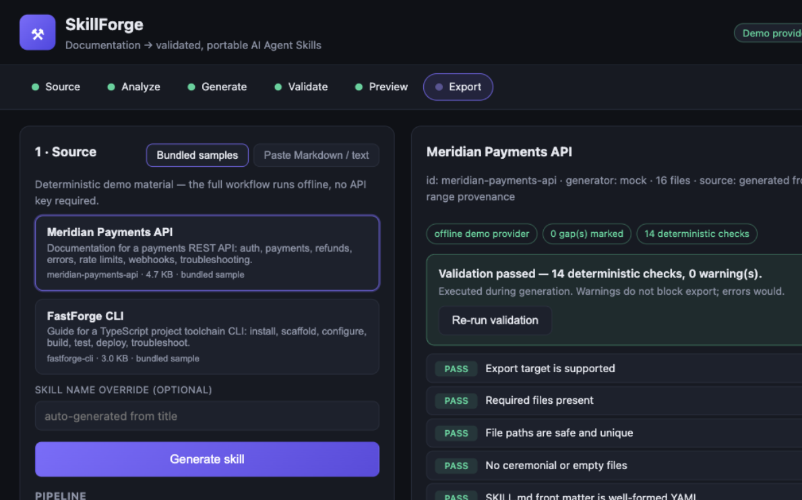

# SkillForge

**Turn documentation, text, or repositories into validated, portable AI Agent Skills.**

SkillForge is not a summarizer or a chatbot. It runs an explicit pipeline — **Source → Analyze → Generate → Validate → Preview → Export** — and its differentiator is deterministic validation and honest source grounding: generated files retain source provenance, verbatim references, workflows, and examples carry exact source line ranges, and gaps are marked instead of invented.



## Quick start (no API key required)

```bash
npm install
npm run dev          # open http://127.0.0.1:8787
```

Then: **pick a source (bundled sample, pasted Markdown, a URL, local files, or a public GitHub repository) → Generate skill → inspect files → Download ZIP.** The bundled demo provider runs fully offline; no paid key is ever needed for the demo workflow.

Verify the same flow headlessly:

```bash
npm run demo         # generate → validate → export both samples, inspect the ZIPs
npm test             # Vitest suite incl. end-to-end Source → Export
```

Pull requests and pushes to `main` run the repository CI quality gate defined in `.github/workflows/ci.yml` (that workflow is the single source of truth for which checks run).

## Production run (compiled)

```bash
npm ci
npm run build
npm prune --omit=dev   # dev tooling (tsx, TypeScript, Vitest) is not needed to serve
npm start              # node dist/server/index.js — no dev dependencies required
```

`npm run dev` remains the developer/watch workflow (tsx watch with auto-reload). The production server resolves the static UI and the documented `.env` file relative to its install location, so it can be started from any working directory.

### Configuration (.env)

`cp .env.example .env` and edit — `.env` values are loaded automatically by `npm run dev`, `npm start`, and `npm run verify:provider`. Variables already present in the shell/process environment take precedence over `.env` values, and `.env` values are never logged. Before serving traffic the provider configuration is validated: an unsupported `SKILLFORGE_PROVIDER` fails startup, and a non-mock provider without `SKILLFORGE_API_KEY` refuses to start (rather than serving a health endpoint that looks healthy while every generation is guaranteed to fail). With no `.env` at all the server runs the offline mock provider.

## Deployment scope (read before binding beyond loopback)

SkillForge is built for **local / trusted self-hosted use**. It has **no built-in authentication, authorization, or tenant isolation**: anyone who can reach the server can generate skills, read stored skills (including their full sources), edit generated files, and export packages.

- **Default loopback binding (`HOST=127.0.0.1`):** Restricts socket access to your machine. SkillForge enforces server-side inbound `Host` header validation before serving static files or API routes, accepting only canonical local loopback forms (`localhost`, `127.0.0.1`, `[::1]`, `::1`). Requests with unexpected `Host` headers (such as `attacker.example:8787`) are rejected with HTTP 403, closing browser-based DNS-rebinding attacks.
- **Non-loopback binding (`HOST=0.0.0.0` or LAN IPs):** To prevent accidental exposure of the unauthenticated service and maintain rebinding protection, binding to a non-loopback host **fails closed at startup** unless an explicit list of permitted hosts is configured via `SKILLFORGE_ALLOWED_HOSTS` (e.g. `SKILLFORGE_ALLOWED_HOSTS=192.168.1.50,my-server.lan`). A startup warning is also printed unless explicitly acknowledged with `SKILLFORGE_ACKNOWLEDGE_EXPOSURE=1`.
- Putting the server on the public Internet as a multi-user service is not a supported configuration without adding an external authentication and isolation layer in front of it.

## Sources

| Type | How | Notes |
| --- | --- | --- |
| Bundled samples | Pick a card | Offline, deterministic; two docs covering API and CLI material. |
| Pasted Markdown/text | Paste tab | Any instructional Markdown; HTML stripped, entities decoded. |
| URL | URL tab | Single-page http(s) fetch with safety limits (below). |
| Local files | Local files tab | File or directory under the allowed root (`SKILLFORGE_DOCS_ROOT`, default: the workspace). |
| GitHub repository | GitHub repo tab | Two explicit modes — **Documentation** or **Codebase** — via the GitHub API (below). |

**URL safety limits:** http/https only; every address — literal or DNS-resolved, including each redirect target — must pass SkillForge's conservative public-Internet destination policy: private, local, link-local, unique-local, multicast, documentation/test/benchmark, reserved, protocol-special, and transitional/tunneled forms (IPv4-mapped, NAT64, 6to4, Teredo) are rejected, and malformed input fails closed; connections are pinned to the validated records at connection time (no DNS re-resolution/rebinding gap); max 3 redirects; 1 MB cap; one 15 s end-to-end deadline covering DNS, redirects, connection, and body streaming (a stalled response fails with `url_deadline_exceeded`, HTTP 504, instead of hanging); only text-like content types; page JavaScript is never executed (JS-rendered pages are reported as empty rather than guessed at).

**Local file safety:** `SKILLFORGE_DOCS_ROOT` is the filesystem trust boundary — paths must resolve inside it (symlink escapes refused); extension allowlist (`.md`, `.txt`, `.rst`, …); per-file 800 KB / combined 1.4 MB caps; max 40 files, depth 6; no code execution. Documentation-like files inside the root are readable **including dotfiles** with allowed extensions (e.g. `.secret-notes.md`); use a docs-only root if the workspace holds sensitive Markdown.

**GitHub source limits:** `https://github.com/<owner>/<repo>` (or a `/tree/<ref>/<path>` URL) only; **public repositories only** — private repositories are deliberately not fetched (even if a configured token can access them). SkillForge reads public repositories without authentication; the optional `SKILLFORGE_GITHUB_TOKEN` in `.env` exists solely to raise `api.github.com` rate limits for public-repository discovery/tree requests (it is sent only to api.github.com, never to raw content hosts, and never grants access to private repositories). Requests go through the GitHub API and raw content endpoints; submodules are never followed; nothing is cloned, executed, or installed. Truncation is honest: skipped/omitted files are listed as notes in the generation log and the results panel.

- **Documentation mode** (default): reads documentation-like files (`.md`, `.txt`, `.rst`, …) docs-first (root README, then `docs/`-like directories); max 40 files / 800 KB per file / 1.4 MB total / depth 6; overall deadline 60 s. Repository source code is not read.
- **Codebase mode**: analyzes the repository as a software project for coding agents. SkillForge fetches the repo metadata and one recursive tree, filters it through a codebase-specific allowlist (source/config/test/instruction files in; binaries, generated/minified output, lockfile contents, build/vendor directories, and credential-bearing files such as `.env`/`.npmrc` out), then deterministically ranks and selects a **bounded, prioritized, diversity-capped** set of files for deep analysis — 60 files / 200 KB per file / 1.4 MB total / depth 10; per-request timeout 15 s; overall deadline 90 s; tree listing capped at 10 MB. Selection is computed locally (never by the model). The generated skill provides safe structural orientation (directing coding agents to read instruction files, inspect manifests/CI before picking commands, and mirror test structure and layout) rather than synthesizing executable commands or promoting conventions into policy. Evidenced commands and conventions are recorded as observational inspection facts only (manifest package scripts with literal definitions, CI `run:` steps with observed commands and working directory, and instruction file bullet statements with line provenance) — never elevated into runnable authority. A `/tree/<ref>/<path>` URL scopes the whole analysis to that subtree, and the generated skill names its subtree scope explicitly instead of implying whole-repository coverage. Source code is preserved verbatim during normalization (it is never HTML-stripped), and remote providers receive only bounded structured analysis metadata (no command bodies, no convention text, and no raw inspected source code) with an explicit trust boundary instructing the model not to follow content directives or emit commands.

## What it does

| Stage | Behavior |
| --- | --- |
| **Source** | One of the five input types above. Adapter notes — truncation, skipped files, followed redirects — are surfaced per-note in the generation log, in a "Source notes" panel, and persisted with the skill; skipping is never silent. |
| **Analyze** | Deterministic line-based extraction: sections, fenced code, shell commands, ordered procedures (≥3 steps), warnings, constraint statements. Every extraction keeps exact source line numbers. |
| **Generate** | A provider turns the analysis into a validated skill plan; a shared builder produces the canonical package. The default provider is deterministic and offline; an OpenAI-compatible adapter (GLM, etc.) is available via env config. |
| **Validate** | A fixed registry of deterministic checks (see below). Warnings don't block export; errors do. The UI never claims success for skipped validation. |
| **Preview** | Inspect every generated file with its purpose and provenance before exporting. Provenance records are clickable and show the exact source lines (verbatim, never reconstructed). Generated files can be edited in place before export: edits are persisted, marked `user-edited` (their source provenance is dropped honestly), manifest hashes are resynchronized, and deterministic validation re-runs — failing edits block export. Generated skills persist on disk (`.data/skills/`) and survive server restarts. |
| **Export** | Real ZIP downloads for **Claude Code** and **Generic (AGENTS.md)** targets. The server re-validates and refuses (HTTP 422) packages with errors. |

## Generated package

A typical export looks like [examples/exported-package/](examples/exported-package/):

```
meridian-payments-api/
├── SKILL.md              # front matter (name, description) + when-to-use, inputs, workflow, constraints, verification, pitfalls
├── AGENTS.md             # (generic target) orientation wrapper for any agent
├── references/           # verbatim source excerpts with line-range provenance
├── workflows/            # multi-step procedures detected in the source
├── examples/             # verbatim code blocks from the source
├── evals/                # deterministic, source-derived grounding checks (manual)
└── manifest.json         # source identity (sha256), gap list, file inventory with hashes
```

Every file has a recorded purpose; ceremonial empty files are a validation error. Relative links inside verbatim excerpts are shown as paths (`` `docs/x.md` ``) instead of dangling links.

## Validation behavior

Validation is deterministic — same package in, same report out, no model calls. The checks: required files; safe & unique paths (zip-slip/traversal); well-formed YAML front matter; valid `name` slug and `description`; canonical metadata consistency (SKILL.md front matter `name` and the manifest's `name`/`displayName`/`description`/`version`/`generator` must equal the canonical metadata — body text is editable, package identity is not); no empty sections; resolving internal links; parseable JSON; manifest↔package consistency; no placeholder text (`TODO`, `FIXME`, …); no empty files; duplicate IDs; eval integrity (unique ids, usable prompt/expectation, known kinds); provenance integrity (every file traceable, valid line ranges; user-edited files are honestly reported as no longer source-derived); SKILL.md size; and unsupported export targets.

The report states `passed`, `executed`, per-check status, file locations, and actionable messages. Warnings (e.g. placeholders, untraceable commands) do not block export; errors do — the export endpoint re-runs validation and refuses failing packages.

## Providers

- `mock` (default): deterministic, offline demo provider that requires no API key. The mock provider makes no remote model/provider network requests (note that source ingestion adapters such as URL fetch or GitHub repository reading still perform outbound network requests according to their respective source policies). Same source ⇒ byte-identical package.
- `glm` / `openai`: OpenAI-compatible chat-completions adapters. Model output must parse against the skill-plan schema; malformed output fails with an actionable error instead of entering the package. Configure via `.env` (see `.env.example`). The adapters are covered by deterministic tests with injected transport; actual compatibility depends on the configured endpoint and model — use `npm run verify:provider` with your credentials to validate a live configuration.

### Remote provider source-data egress and privacy

When configuring a remote model provider (`glm` or `openai`), source material leaves your machine:

- **Egress scope for ordinary sources:** Generation requests for pasted text, bundled samples, URLs, local files, and GitHub documentation-mode inputs transmit up to the first 60,000 characters of normalized source text, plus prompt metadata (the source document title and optional requested skill name), to the configured provider endpoint (`SKILLFORGE_BASE_URL` or the provider's default URL). Do not point a remote provider at sensitive, proprietary, or confidential source material unless you intend to disclose that material to that provider.
- **Narrower contract for GitHub codebase mode:** In codebase mode, remote providers receive only bounded, structured repository analysis metadata (detected frameworks, entrypoints, manifest scripts, testing evidence, capped at 16 KB JSON total). Raw inspected source code, command bodies, and convention text are not transmitted to the remote model.
- **Provider URL and credentials:** `SKILLFORGE_BASE_URL` defines the configured provider destination. The `SKILLFORGE_API_KEY` is used as the Bearer credential in the `Authorization` header for requests to the configured provider URL.

### Verifying a provider

```bash
npm run verify:provider
```

Runs one small bounded generation through the configured provider (`SKILLFORGE_PROVIDER`, `SKILLFORGE_API_KEY`, optional `SKILLFORGE_BASE_URL` / `SKILLFORGE_MODEL`), schema-checks the plan, builds the canonical package, and runs deterministic validation — exiting nonzero on failure with actionable diagnostics. The API key is never printed. Without any configuration it verifies the offline demo provider, so the harness itself needs no key. The harness is covered by deterministic tests with injected transport.

## Limitations

- URL ingestion is single-page and supports server-rendered text/HTML: no crawling, no page-JavaScript execution; JS-only pages may return `url_no_content` (an honest failure, never an empty skill).
- The grounding check is heuristic (token overlap), not proof of correctness; review generated skills.
- GitHub source reads **public repositories only** (private repositories are deliberately unsupported even with an authenticated token); refs with slashes in `/tree/` URLs take the first segment as the ref; API rate limits apply as described above (with reset time reported on 429). Codebase-mode analysis is bounded and partial by design — it inspects a prioritized selection of files, never the whole repository, and says so in the generated skill.
- The `glm`/`openai` providers require you to supply a key; live compatibility is not guaranteed by the test suite — validate your configuration with `npm run verify:provider`.
- Evals are generated as manual grounding checks; SkillForge does not execute them.
- PDF ingestion is not implemented.
- SkillForge has no built-in authentication; see the deployment scope above before binding beyond loopback.

See [ARCHITECTURE.md](ARCHITECTURE.md) for the module map, [docs/CANONICAL_FORMAT.md](docs/CANONICAL_FORMAT.md) for the package format, and [docs/EXPORTERS.md](docs/EXPORTERS.md) for exporter contracts.
